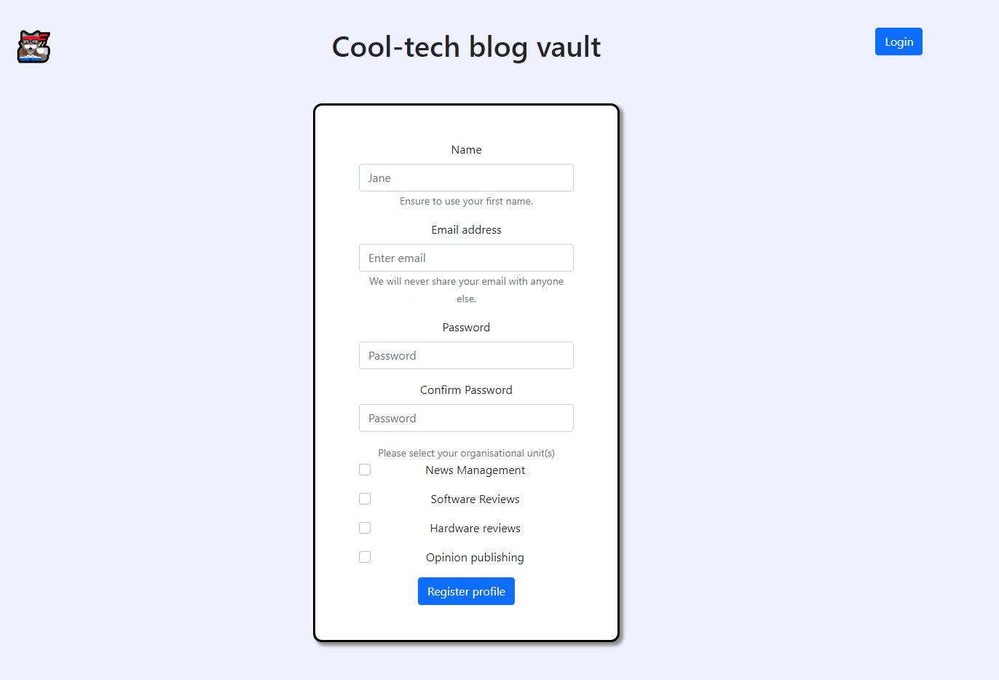
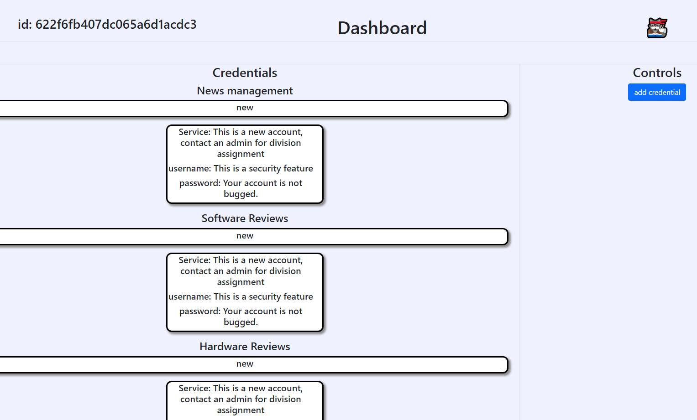
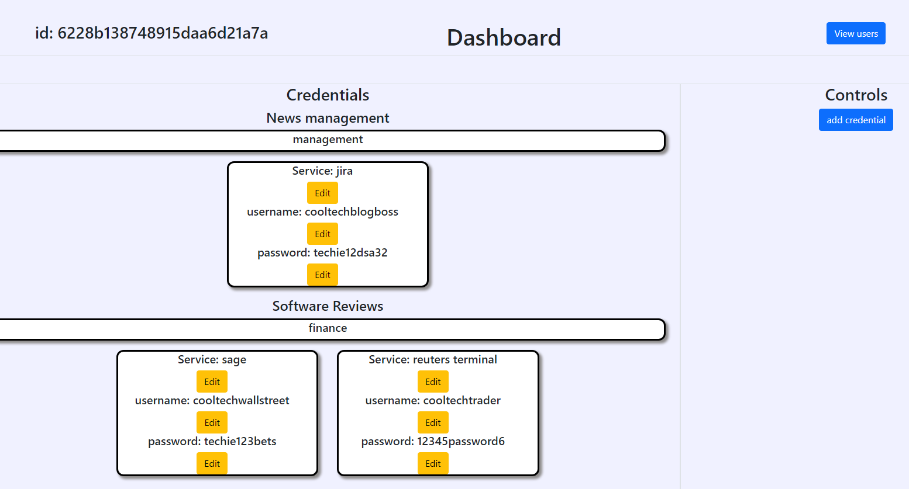
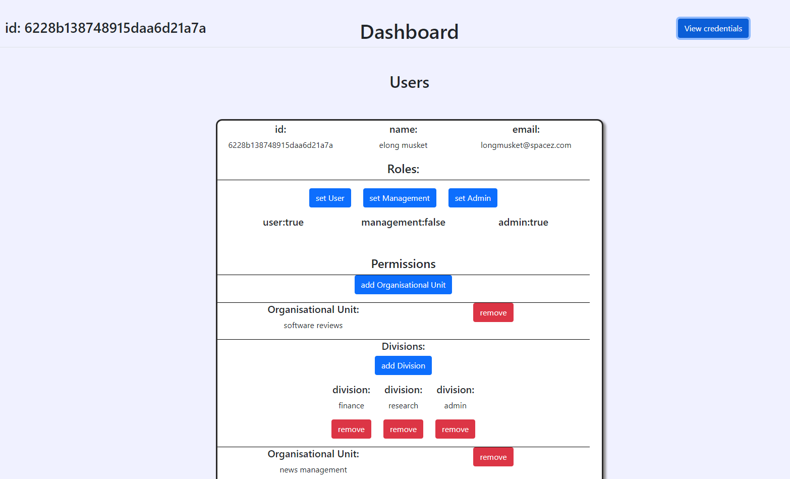

# Credentials-manager (Cooltechblog)

A credentials manager with role permissions - built for a HyperionDev Capstone Task.
This react application utilises the MERN stack to offer authentication with role based users, further
all CRUD operations can be performed also constrained by roles.


## Getting started

### Backend start
Run the command in the backend directory to start the webserver (needed for the api calls).
```
cd backend 

```
```
npm start 

```

### Frontend start

Cd to the frontend directory, run the command below to start the frontend
```
cd frontend 

```
```
npm start 

```

### Dev start (backend)

Cd to the backend directory and run the command below to initiate the dev server

```
npm run devStart

```
## Usage

navigate to localhost:3000 in your browser of choice to interact with the application

#### Note

a .env file should be created in the backend directory,
in this format

```
MONGO_USERNAME = "your username"
MONGO_PASSWORD = "your password"
PORT = 5000
JWT_SECRET = "your secret"
```
## Homepage


Login screen presented with the option to create a user

## Register User

user creation portal, these users can't see any credentials,
until an admin has granted them access

## Dashboard User View

standard Dashboard portal view for a base user
user can only add credentials

## Dashboard Management/Admin view

Management/Admin view of the dashboard
where credentials can be changed

## Users view

Users management view od the dashboard for admins,
where roles & permissions can be altered
## License

[MIT](https://choosealicense.com/licenses/mit/)


## Authors

- [@JasperWiese](https://github.com/Jaswiese)

