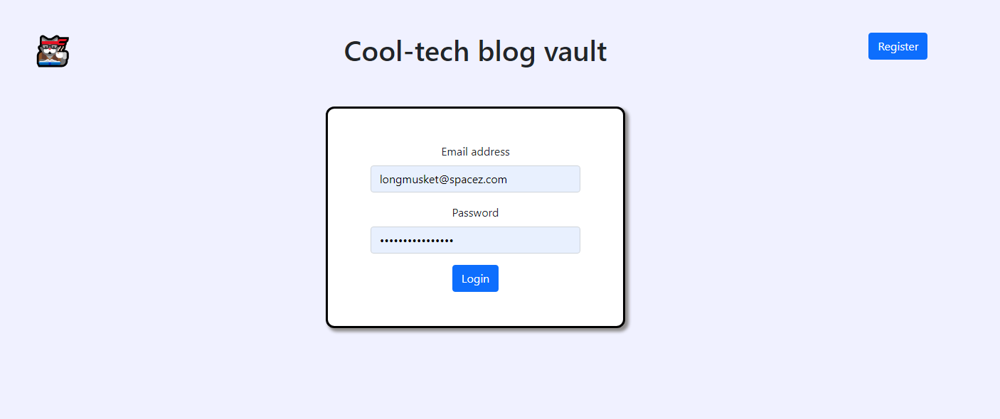

# Credentials-manager (Cooltechblog)

A credentials manager with role permissions - built for a HyperionDev Capstone Task.
This react application utilises the MERN stack to offer authentication with role based users, further
all CRUD operations can be performed  constrained by roles.


## Getting started

## Run Locally

Clone the project

```
  git clone https://github.com/Jaswiese/credentials-manager
```

Go to the project directory

```
  cd my-project
```

### Backend

Go to the backend directory

```
  cd backend
```
Install dependencies

```
  npm install

```
Create a .env file in the root directory of the backend, use the following format for the file:

```
MONGO_USERNAME="your_username"
MONGO_PASSWORD="your_password"
PORT=5000
JWT_SECRET="your_secret"

```
When you have successfully created the .env file you can now, start the backend,

The command below will run the server with nodemon, allowing for automatic server restarts when the backend code changes:

```
  npm run devStart

```
If you do not need the nodemon functionality, you can run the following command instead:

```
  npm start 

```
### Frontend

cd to the frontend directory

```
cd frontend 

```
Install the dependencies for the frontend, by running the following command:

```
npm install

```
To start the frontend, run the following command (in the frontend directory)

```
npm start 

```

## Usage

navigate to localhost:3000 in your browser of choice to interact with the application

*** Please note that you need both the backend and the frontend running for the application to function ***

## Homepage



Login screen presented with the option to create a user

## Register User

user creation portal, these users can't see any credentials,
until an admin has granted them access

## Dashboard User View

standard Dashboard portal view for a base user
user can only add credentials

## Dashboard Management/Admin view

Management/Admin view of the dashboard
where credentials can be changed

## Users view

Users management view of the dashboard for admins,
where roles & permissions can be altered
## License

[MIT](https://choosealicense.com/licenses/mit/)


## Authors

- [@JasperWiese](https://github.com/Jaswiese)

